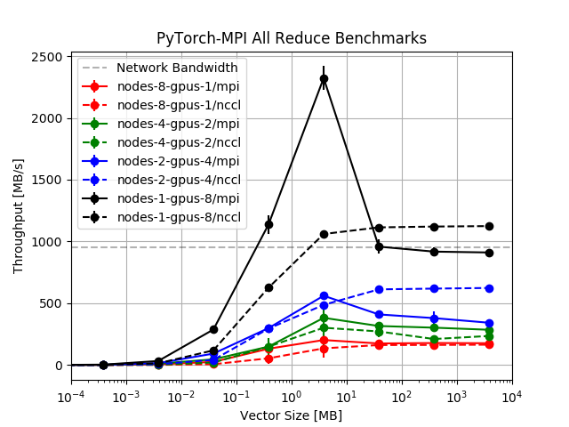

# Benchmark Collective Communication

In this experiment, we compare the performance of all reduce NCCL between and MPI in:

1. 8 nodes with 1 GPU per node
2. 4 nodes with 2 GPUs per node
3. 2 nodes with 4 GPUs per node
4. 1 node with 8 GPUs

We use PyTorch distributed package to all reduce float32 vectors with 10 to 10^9 elements (~4GB). All experiments are repeated for 100 times.

## Environment
In this experiment, we use gcloud Kubernetes cluster. For nodes with 1 or 2 gpus we use `n1-standard-4` type machine; for nodes with 4 GPUs, `n1-standard-8` type machien is used; for nodes with 8 GPUs, `n1-standard-16` type machine is used.

K80 GPUs are used throughout the experiments. The connection between GPUs are PHB which traverss PCIe as well as a PCIe Host Bridge (typically the CPU), see appendix. NCCL's performance can be improved if NVLink high-speed interconnect is available.

## Results
The results of experiments are shown below. Note that the bandwidth here is calculated by dividing the vector size by the time it spent. The actual bandwidth depends on the implementation of all reduce.


- The NCCL all reduce does not give better performance when the GPU per machine is 1 or 2.
- If the vector is large and there is no inter-node communication (1 node 8 GPUs), NCCL also outperforms MPI.

## Appendix
### Make sure NCCL is installed.
```python
>>> import torch
>>> print(torch.cuda.nccl.is_available())
True
>>> print(torch.cuda.nccl.version())
2005
```

### Topology of the GPUs
```bash
nvidia-smi topo --matrix
```
<pre>
    GPU0    GPU1    GPU2    GPU3    GPU4    GPU5    GPU6    GPU7    CPU Affinity
GPU0     X  PHB PHB PHB PHB PHB PHB PHB 0-15
GPU1    PHB  X  PHB PHB PHB PHB PHB PHB 0-15
GPU2    PHB PHB  X  PHB PHB PHB PHB PHB 0-15
GPU3    PHB PHB PHB  X  PHB PHB PHB PHB 0-15
GPU4    PHB PHB PHB PHB  X  PHB PHB PHB 0-15
GPU5    PHB PHB PHB PHB PHB  X  PHB PHB 0-15
GPU6    PHB PHB PHB PHB PHB PHB  X  PHB 0-15
GPU7    PHB PHB PHB PHB PHB PHB PHB  X  0-15

Legend:

  X    = Self
  SYS  = Connection traversing PCIe as well as the SMP interconnect between NUMA nodes (e.g., QPI/UPI)
  NODE = Connection traversing PCIe as well as the interconnect between PCIe Host Bridges within a NUMA node
  PHB  = Connection traversing PCIe as well as a PCIe Host Bridge (typically the CPU)
  PXB  = Connection traversing multiple PCIe switches (without traversing the PCIe Host Bridge)
  PIX  = Connection traversing a single PCIe switch
  NV#  = Connection traversing a bonded set of # NVLinks
</pre>
Topology Test : `/usr/local/cuda/samples/1_Utilities/topologyQuery/topologyQuery`
<pre>
GPU0 <-> GPU1:
  * Atomic Supported: no
  * Perf Rank: 0
...
</pre>

### Commands to reproduce results
```bash
# At the time of writing, https://www.github.com/mlbench/mlbench
export MLBENCH_HOME=/path/to/mlbench/
bash nodes-8-gpus-1.sh create-cluster
bash nodes-8-gpus-1.sh mpi
bash nodes-8-gpus-1.sh nccl
bash nodes-8-gpus-1.sh cleanup-cluster

bash nodes-4-gpus-2.sh create-cluster
bash nodes-4-gpus-2.sh mpi
bash nodes-4-gpus-2.sh nccl
bash nodes-4-gpus-2.sh cleanup-cluster

bash nodes-2-gpus-4.sh create-cluster
bash nodes-2-gpus-4.sh mpi
bash nodes-2-gpus-4.sh nccl
bash nodes-2-gpus-4.sh cleanup-cluster

bash nodes-1-gpus-8.sh create-cluster
bash nodes-1-gpus-8.sh mpi
bash nodes-1-gpus-8.sh nccl
bash nodes-1-gpus-8.sh cleanup-cluster
```
If you found `Error: tiller was not found. polling deadline exceeded` during `helm init` phase like https://github.com/helm/helm/issues/3379 and https://github.com/helm/helm/issues/3393, cleanup the cluster and create it again.
