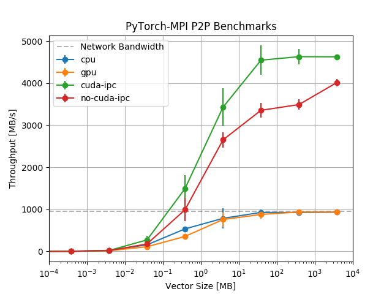

We use the `mlbench/mlbench_worker:latest` as the worker image to provides environment for `torch-cuda`, `mpi`.

Gcloud all of the K80 gpus are used . Maximum vector size used is 4GB.

### Benchmark MPI CUDA-IPC option
Openmpi `--mca btl_smcuda_use_cuda_ipc`. CUDA IPC improves MPI communication between GPUs on a node. [70% and 78% improvement in bandwidth for two sided communication](https://www.researchgate.net/publication/230795427_Optimizing_MPI_communication_on_multi-GPU_systems_using_CUDA_inter-process_communication?enrichId=rgreq-4d5cce8b621ded7c5550036f24ef00a6-XXX&enrichSource=Y292ZXJQYWdlOzIzMDc5NTQyNztBUzoyMzMwNjgxNTM3OTg2NTZAMTQzMjU3OTE4NjE5Mw%3D%3D&el=1_x_3&_esc=publicationCoverPdf).

We show the impact of MPI-IPC by sending/receiving a vector on a node with two GPUs. Run
```bash
bash compare_cuda_ipc.sh create-cluster
bash compare_cuda_ipc.sh cuda-ipc
bash compare_cuda_ipc.sh no-cuda-ipc
bash compare_cuda_ipc.sh cleanup-cluster
```

Note that when `--mca btl_smcuda_use_cuda_ipc` option is enabled, there will be a warning after the program finishes

    --------------------------------------------------------------------------
    The call to cuIpcCloseMemHandle failed. This is a warning and the program
    will continue to run.
      cuIpcCloseMemHandle return value:   4
      address: 0x2113a0000
    Check the cuda.h file for what the return value means. Perhaps a reboot
    of the node will clear the problem.
    --------------------------------------------------------------------------
    [rel-mlbench-worker-0:02668] Sleep on 2668

After that the process will sleep for 20 seconds. Everything else should be fine.

### Benchmark Communication of CPU and GPU
Create a cluster of 2 nodes each with 1 GPU.
```bash
bash compare_cpu_gpu.sh create-cluster
bash compare_cpu_gpu.sh cpu
bash compare_cpu_gpu.sh gpu
bash compare_cpu_gpu.sh cleanup-cluster
```

### Plot
Plot with command `python plot.py` gives



---
### Appendix 
#### OpenMPI related issues
* Use `ompi_info --parsable --all | grep mpi_built_with_cuda_support:value` to know if the openmpi used support cuda
* To see if your OFED stack has GPU Direct RDMA support: `ompi_info --all | grep btl_openib_have_driver_gdr`
* GPU Direct RDMA: `ompi_info --all | grep btl_openib_have_cuda_gdr`

#### Benchmark Network Bandwidth
Use one of the workers as a server
```bash
iperf -s
```
which shows

    root@rel-mlbench-worker-1:/app# iperf -s
    ------------------------------------------------------------
    Server listening on TCP port 5001
    TCP window size: 85.3 KByte (default)
    ------------------------------------------------------------
    [  4] local 10.12.1.13 port 5001 connected with 10.12.0.8 port 54500
    [ ID] Interval       Transfer     Bandwidth
    [  4]  0.0-10.0 sec  8.91 GBytes  7.65 Gbits/sec

Use the other worker as a client
```bash
iperf -c server/ip
```
which shows
  
    root@rel-mlbench-worker-0:/app# iperf -c 10.12.1.13
    ------------------------------------------------------------
    Client connecting to 10.12.1.13, TCP port 5001
    TCP window size: 45.0 KByte (default)
    ------------------------------------------------------------
    [  3] local 10.12.0.8 port 54500 connected with 10.12.1.13 port 5001
    [ ID] Interval       Transfer     Bandwidth
    [  3]  0.0-10.0 sec  8.91 GBytes  7.66 Gbits/sec

#### Benchmark CUDA Bandwidth on 1 node
NVIDIA has provided tools for benchmarking in the cuda examples.
```bash
cd /usr/local/cuda-9.0/samples/1_Utilities/bandwidthTest && make
/usr/local/cuda-9.0/samples/1_Utilities/bandwidthTest/bandwidthTest
```
For one K80 device

    [CUDA Bandwidth Test] - Starting...
    Running on...

     Device 0: Tesla K80
     Quick Mode

     Host to Device Bandwidth, 1 Device(s)
     PINNED Memory Transfers
       Transfer Size (Bytes)    Bandwidth(MB/s)
       33554432         8267.2

     Device to Host Bandwidth, 1 Device(s)
     PINNED Memory Transfers
       Transfer Size (Bytes)    Bandwidth(MB/s)
       33554432         10061.6

     Device to Device Bandwidth, 1 Device(s)
     PINNED Memory Transfers
       Transfer Size (Bytes)    Bandwidth(MB/s)
       33554432         155756.1

    Result = PASS

    NOTE: The CUDA Samples are not meant for performance measurements. Results may vary when GPU Boost is enabled.

